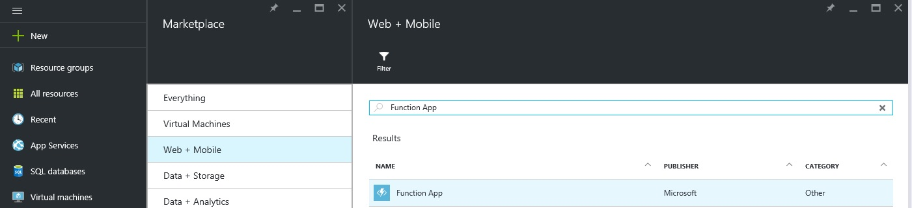
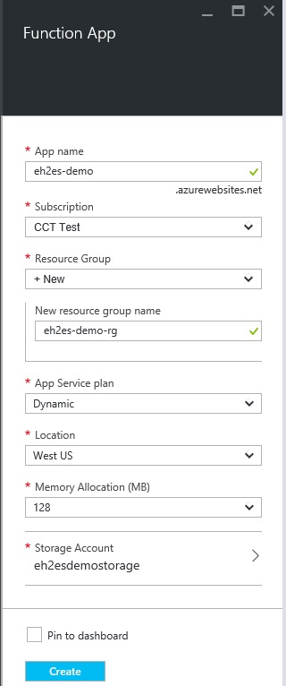
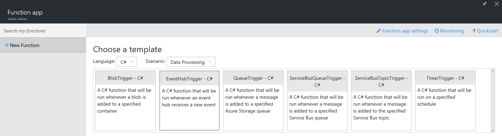
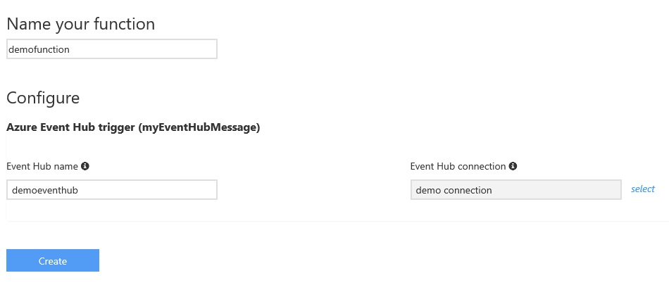
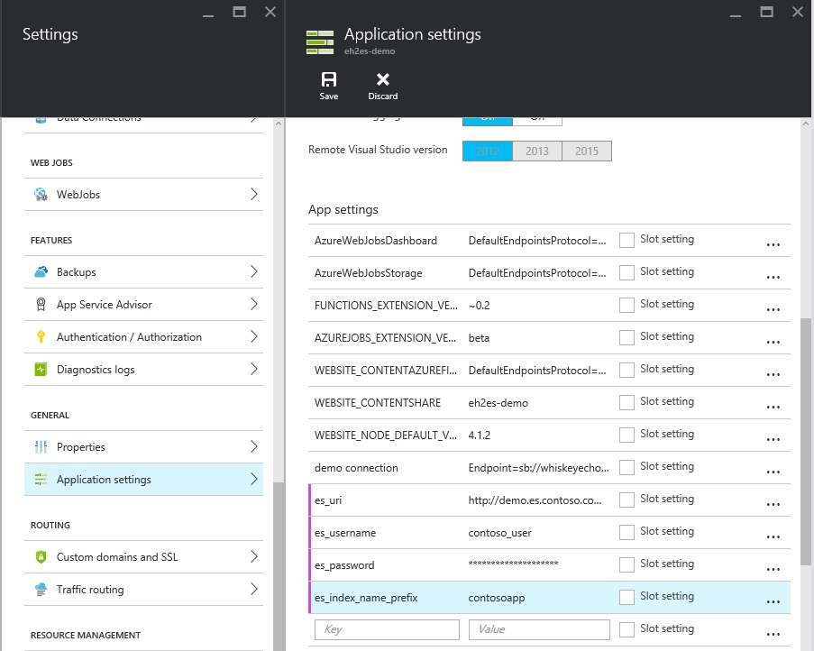
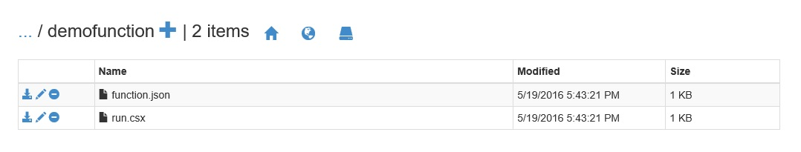

# Sending WAD data from Event Hubs to Elastic Search
This folder contains the code necessary to setup an [Azure Function](https://azure.microsoft.com/en-us/documentation/articles/functions-overview/) for pumping WAD data from Event Hubs to Elastic Search.
## Setup the demo Azure Function
1. Sign in to the [Azure management portal](https://portal.azure.com).
2. Click "New" on the left side menu and on the Marketplace blade, select "Web + Mobile".
3. On the "Web + Mobile" blade, search for Function App. 
4. Click "Create" on the Function App blade.
5. Fill in the required fields and click "Create".  
6. Wait until the deployment is completed, open the Function App just created.
7. On the Function App blade, click "New Function". Choose the "EventHubTrigger - C#" template. 
8. Name the function and fill in the Event Hub connection string. *Note: when pasting the Event Hubs connection string, please do not include the EntityPath parameter or you'll get an error message after the Function App is created.* More information on [Get started with Event Hubs](https://azure.microsoft.com/en-us/documentation/articles/event-hubs-csharp-ephcs-getstarted/). 
9. On the Function app blade, click "Function app Settings", then click "Go to App Service Settings".
10. On the Settings blade, click General - Application settings, and add the following settings: *es_uri*, *es_username*, *es_password*, *es_index_name_prefix (optional)*. 
11. Paste the code from run.csx into the Code section on the Function app blade and click Save. 
12. In a new browser window, navigate to &lt;function name&gt;.scm.azurewebsites.net (in this case, the function name is *eh2es-demo*).
13. In the Kudu UI, select Debug console -> CMD; and navigate to home\site\wwwroot\demofunction.
14. Drag and drop the project.json file into the file list. 
15. The demo function should be up and running.

## Function application custom settings
__es_uri__

Sets the target Elastic Search endpoint.

__es_username__

Sets the username for accessing the ES endpoint.

__es_password__

Sets the password for accessing the ES endpoint.

__es_index_name_prefix__

*Optional* Sets the ES index name prefix. The index name will be generated based on current date, in the follow format &lt;prefix&gt;-YYYY.MM.DD; for example *demoname-2016.05.19*.

## File list
__run.csx__

This is the C# script file containing the Azure Function code.

__project.json__

Containing the NuGet package references required by the Azure Function code.