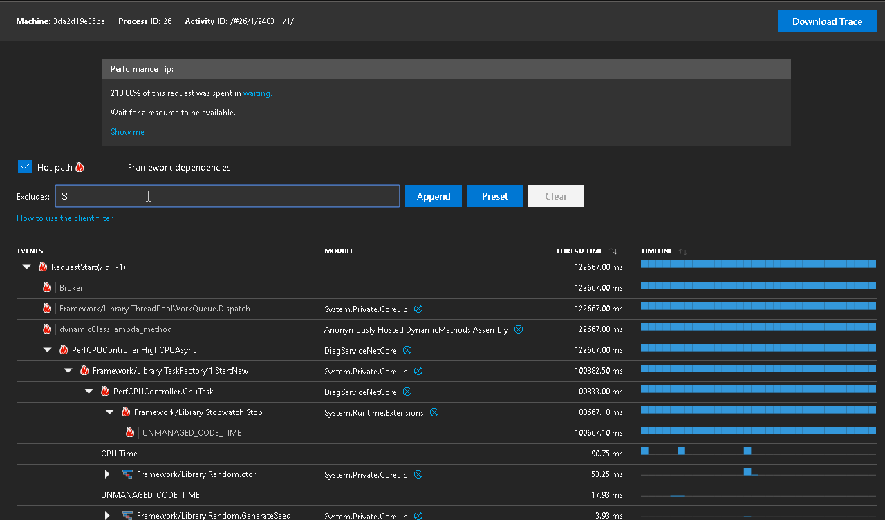
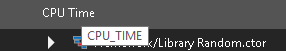

# The call tree filter

## Why the filter

CallTree expose a lot of performance information, sometimes, it is too much. We introduced a filter to reduce the noise.

With the ability to filter out stacks on the call tree, it will be easier to focus onto modules that is interesting.

## Basic usage

### Filtering an module

Click the **&#x2B59;** sign right to the module name to filter out the specific module. When you see an uninterested module and you want to hide stacks from that module, this is the way.

_Tips: notice the `!` sign at the end of the module name._

### Use presets

Try the `Preset` button right to the `Append`. It will add the filters to hide most of the framework stacks from the call tree.

### Typing for filtering

In the text box, typing in the strings for filter and press **Enter** or use the `Apply` button.

_Tips: Try filter more than one string separate by semicolon like `Microsoft;System`._

### Removes an exclusion

When applied the filter by mistake, it can be removed by using the **&#x2573;** button to the right of the filter in the list.

## The filter's characteristic

* It hides the stack that matches;
* It is case sensitive;
* It is partial string match;

## Caveats

Despite the characteristics of the filters, you might notice it not working as expected. There are several caveats that might become interesting.

### Ancestors might be filtered

It might filter out ancestors for the interested node. Expand the tree so that the information is loaded before applying a filter on it.

### It might not match what you see

Under the hood, the filter matches the raw label than the polished display text. For example, `CPU_TIME` is displayed as `CPU Time`, but the filter will still only match `CPU_TIME`.

To find out the raw label, hover the mouse over the text:

## Moving forward

We are looking into providing better presets of filters as well as better ways to add/remove filters. Please leave us a comment on the GitHub if there's suggestions for the filters.
